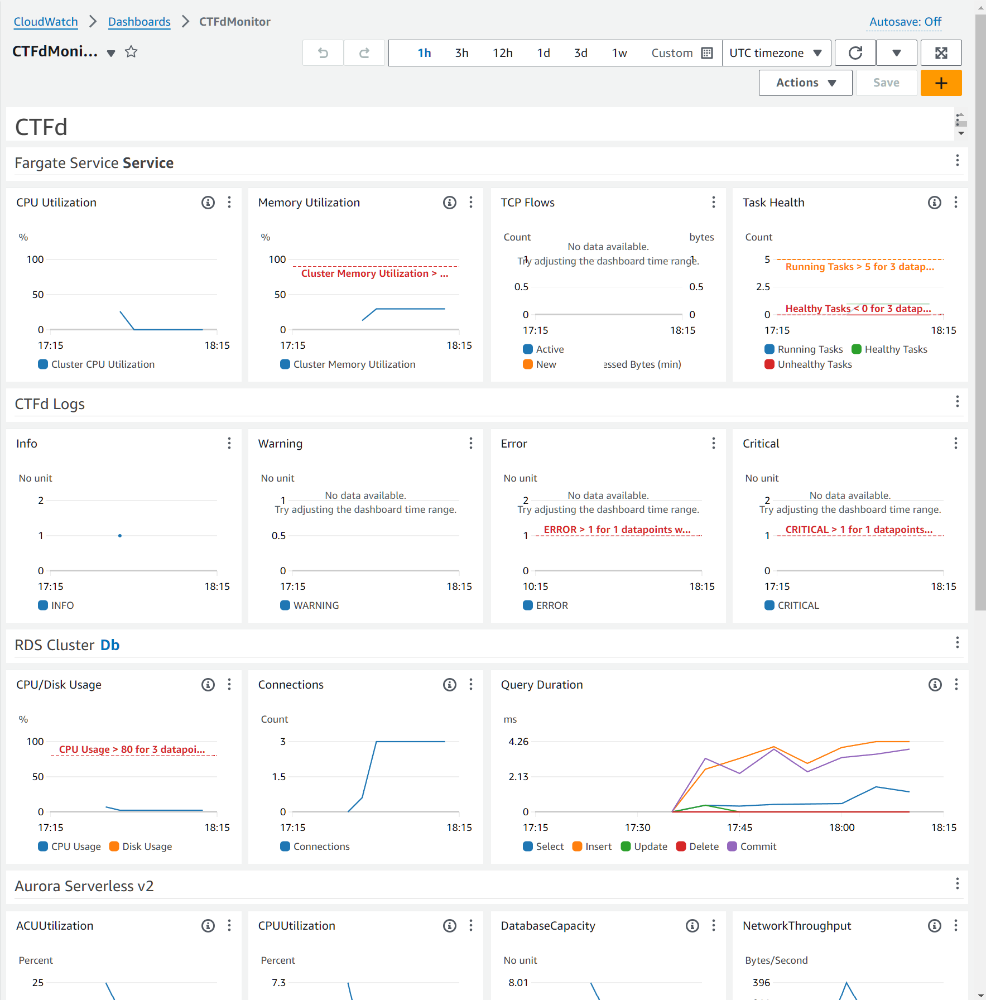
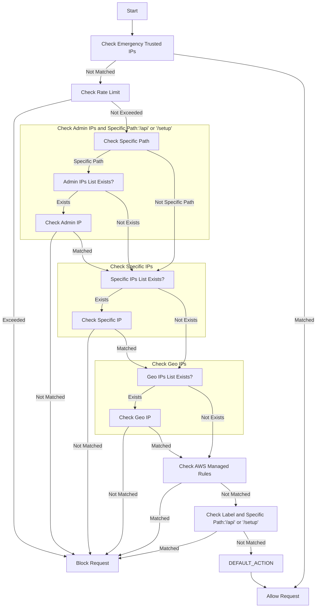

### ⚠️ Note: This repository contains experimental code and is not recommended for production use. Use at your own risk.

# ExcessiveCloudTFd

This repository provides a template to deploy [CTFd](https://github.com/CTFd/CTFd) on AWS using the AWS Cloud Development Kit (CDK). CTFd is a Capture The Flag (CTF) framework, which can be used to deploy CTF challenges.

## Features Enabled

The following features are enabled by deploying CTFd using AWS CDK:

- **Hosting**: CTFd is hosted in containers managed by Amazon ECS and AWS Fargate.
- **Data Persistence**: Data persistence with Aurora Serverless and S3.
- **Auto Scaling**:  Auto-scaling for ECS and Aurora Serverless (ElastiCache does not auto-scale).
- **Email Sending**: Email sending from CTFd using SES.
- **Security**: Protection with WAF, with relaxed protection for specific IPs.
- **CDN Caching**: CDN caching of themes and S3 objects (via CTFd plugin).

## Table of Contents

- [Architecture](#architecture)
- [Libraries Used](#libraries-used)
- [Prerequisites](#prerequisites)
- [Getting Started](#getting-started)
- [Configuration](#configuration)
- [Clean Up](#clean-up)
- [Contributing](#contributing)
- [License](#license)

## Architecture

The AWS CDK stack provisions the following resources (this list is not exhaustive):

- Containers
    - Amazon ECS
    - Amazon ECR
    - AWS Fargate
- Database
    - Amazon Aurora Serverless v2(MySQL)
    - Amazon ElastiCache(Redis)
- Strage
    - Amazon S3
- Network & Content Delivery
    - Amazon CloudFront
    - Amazon Route 53
    - Amazon VPC
    - Elastic Load Balancing(ALB)
- Security, Identity & Compliance
    - Amazon SES
    - Amazon SNS
    - AWS WAF
    - AWS Secrets Manager
    - Amazon CloudWatch Dashboards
    - AWS IAM
- Compute
    - AWS Lambda (CloudFormation Custom Resource)


## Libraries and Tools Used

- [projen](https://projen.io/)
- [CTFd](https://github.com/CTFd/CTFd)
- [CTFd plugin(CTFd-CloudFront-signed-url)](https://github.com/raihalea/CTFd-CloudFront-signed-url)
- [cdk-monitoring-constructs](https://github.com/cdklabs/cdk-monitoring-constructs)
- [cdk-nag](https://github.com/cdklabs/cdk-nag)


## Prerequisites

Ensure you have the following installed and configured:

- AWS CDKv2
    - https://docs.aws.amazon.com/cdk/v2/guide/home.html
- Route53 hosted zone
    - A valid hosted zone created in Route 53 for your domain

## Getting Started

1. Clone this repository:

    ```bash
    git clone https://github.com/raihalea/ExcessiveCloudTFd.git
    cd ExcessiveCloudTFd
    ```

2. Initialize the CTFd repositories and others:

    ```bash
    yarn initial-ctfd-repos
    ```

3. Copy the configuration template and fill in the initial settings:

    ```bash
    cp ./src/lib/config/config-copy.ts ./src/lib/config/config.ts
    ```

4. Deploy the stack:

    ```bash
    cdk deploy --all
    ```

This will create all the necessary AWS resources and output the URL where your CTFd instance is available.

## Configurations
### Configurations in `config.ts`

| Variable        | Key            | Description                                                                                   |
|-----------------|----------------|-----------------------------------------------------------------------------------------------|
| `awsConfig`     | `account`      | AWS account ID where CTFd containers are deployed.                                            |
| `awsConfig`     | `region`       | AWS region where CTFd containers are deployed.                                                |
| `globalConfig`  | `account`      | AWS account ID for global resources like CloudFront and WAF.                                  |
| `globalConfig`  | `region`       | AWS region for global resources like CloudFront and WAF. Fixed to `us-east-1`.                |
| `databaseConfig`| `DB_USER`      | Database user name for Aurora database.                                                       |
| `databaseConfig`| `DB_PORT`      | Database port for Aurora database.                                                            |
| `databaseConfig`| `backtrackWindow` | Duration for backtrack window in Aurora database.                                           |
| `redisConfig`   | `DB_USER`      | Redis user name.                                                                              |
| `redisConfig`   | `DB_PORT`      | Redis port.                                                                                   |
| `domainConfig`  | `DOMAIN_NAME`  | Domain name for CTFd instance.                                                                |
| `domainConfig`  | `HOSTNAME`     | Hostname for the CTFd instance.                                                               |
| `domainConfig`  | `ALB_HOSTNAME` | Hostname for the Application Load Balancer.                                                   |
| `domainConfig`  | `MAIL`         | Mail domain for CTFd instance.                                                                |
| `basicAuthConfig` | `IsEnabled`  | Enable or disable basic authentication.                                                       |
| `basicAuthConfig` | `USER`       | Basic auth user name.                                                                         |
| `basicAuthConfig` | `PASS`       | Basic auth password.                                                                          |

| Variable                     | Sub-Variable             | Key                     | Description                                                  |
|------------------------------|--------------------------|-------------------------|--------------------------------------------------------------|
| `wafConfig`                  |                          | `isEnabled`             | Enable or disable WAF.                                       |
| `wafConfig`                  | `emergencyTrustedIpsRule`| `isEnabled`             | Enable or disable emergency trusted IPs rule.                |
| `wafConfig`                  | `emergencyTrustedIpsRule`| `IPv4List`              | List of trusted IPv4 addresses.                              |
| `wafConfig`                  | `emergencyTrustedIpsRule`| `IPv6List`              | List of trusted IPv6 addresses.                              |
| `wafConfig`                  | `adminIpsRule`           | `isEnabled`             | Enable or disable admin IPs rule.                            |
| `wafConfig`                  | `adminIpsRule`           | `IPv4List`              | List of admin IPv4 addresses.                                |
| `wafConfig`                  | `adminIpsRule`           | `IPv6List`              | List of admin IPv6 addresses.                                |
| `wafConfig`                  | `blockNonSpecificIpsRule`| `isEnabled`             | Enable or disable blocking non-specific IPs rule.            |
| `wafConfig`                  | `blockNonSpecificIpsRule`| `IPv4List`              | List of non-specific IPv4 addresses.                         |
| `wafConfig`                  | `blockNonSpecificIpsRule`| `IPv6List`              | List of non-specific IPv6 addresses.                         |
| `wafConfig`                  | `geoMatchRule`           | `isEnabled`             | Enable or disable geo match rule.                            |
| `wafConfig`                  | `limitRequestsRule`      | `isEnabled`             | Enable or disable limiting requests rule.                    |
| `wafConfig`                  | `managedRules`           | `isEnabled`             | Enable or disable managed rules.                             |

## Monitoring

The monitoring setup includes:

- **Amazon CloudWatch Dashboards**: Provides a visual representation of various metrics.
  
- **Amazon SNS**: Sends notifications based on:
  - **CloudWatch Metrics and Alarms**: Monitors the application and triggers alarms based on specified thresholds.
  - **MetricFilter for Containers**: Monitors container logs and triggers SNS notifications based on specific log patterns.

SNS notifications can be sent to various endpoints, including email and Slack.

## WAF Rules

### Rule Details
1. Check Emergency Trusted IPs: Checks if the traffic is from trusted IPs and allows the request if matched.
1. Check Rate Limit: Checks the number of requests per IP and blocks the request if the limit is exceeded.
1. Check Admin IPs and Specific Path: Checks if the admin IP list exists and verifies admin IPs. If not matched, checks specific paths (e.g., /api/ or /setup).
1. Check Specific IPs: Checks if the specific IP list exists and verifies specific IPs. If not matched, proceeds to check Geo IPs.
1. Check Geo IPs: Checks the origin country of the traffic and blocks the request if from a disallowed country.
1. Check AWS Managed Rules: Inspects traffic based on AWS managed rules and blocks the request if matched.
1. Check Label and Specific Path: Checks specific labels and paths (e.g., /api/ or /setup) and blocks the request if matched.
1. Default Action: The final action is to allow the request.


**Note:** The diagram is a simplified representation and may not capture all the intricacies of the actual AWS WAF rules.

## Clean Up

To remove the deployed resources, run:

```bash
cdk destroy --all
```

## License

This project is licensed under the MIT License. See the [LICENSE](LICENSE) file for details.
